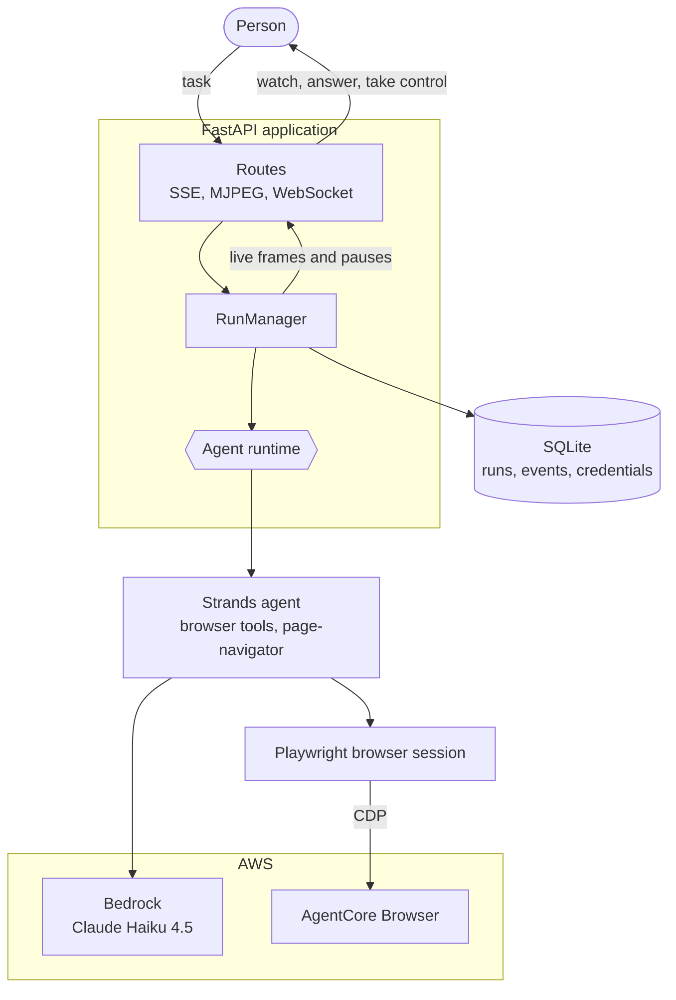

# Tabvio

Tabvio is a web browser agent that plans, executes, and verifies multi-step web
tasks, and hands the keyboard back to you for the parts a machine should not do
alone. It watches its own browser, stops at payment pages, asks for verification
codes through a one-time input that is never written to run history, and lets
you take the controls mid-run and give them back.

The agent runs on the [AWS Strands SDK](https://strandsagents.com/) against
Amazon Bedrock models, and drives a managed Chrome on Amazon Bedrock AgentCore
Browser.

## Architecture



The run manager never sees a framework type. The runtime turns the agent stream
into `custom`, `message`, and `interrupt` items, and the dashboard, the live
view, the takeover socket, and the credential vault all work from those.

**Where the interesting parts live**

| Concern | Path |
| --- | --- |
| Browser agent, tools, step plan | `tabvio/agents/strands/browser_agent/` |
| Page-navigator subagent | `tabvio/agents/strands/page_navigator/` |
| Models, events, telemetry | `tabvio/agents/strands/shared/` |
| Agent runtime and event normalising | `tabvio/runs/runtime.py` |
| Run lifecycle and events | `tabvio/runs/service.py` |
| Browser, scanning, payment detection | `tabvio/browser/` |
| Managed browser over CDP | `tabvio/browser/agentcore.py` |
| Encrypted credential vault | `tabvio/credentials/` |

## Development

Install dependencies and the Playwright browser:

```powershell
uv sync
uv run playwright install chromium
```

Start the application:

```powershell
uv run uvicorn tabvio.main:app --reload
```

Run the checks:

```powershell
uv run pytest
uv run ruff check .
```

## Models and browser

`TABVIO_MODEL_PROVIDER` picks Bedrock or OpenAI. Bedrock
needs AWS credentials on the machine and both models enabled in `AWS_REGION`.
Model ids must be cross-region inference profiles rather than bare ids; list
what your account can reach with:

```powershell
aws bedrock list-inference-profiles --region us-west-2
```

`TABVIO_BROWSER_BACKEND=agentcore` replaces the locally launched Chromium with
a managed browser session on Bedrock AgentCore, reached over the Chrome
DevTools Protocol. Everything downstream is unchanged: the same Playwright
calls, the same live view, the same takeover socket. Sessions bill by the
minute and are stopped when a run ends.

Every setting is documented in `.env.example`.

## Accounts

Sign-in runs through [WorkOS AuthKit](https://workos.com/docs/authkit). Create a
WorkOS application and set `WORKOS_API_KEY`, `WORKOS_CLIENT_ID`, and
`WORKOS_COOKIE_PASSWORD` as described in `.env.example`.

The callback URL is derived from the request, so it needs no configuration, but
it does have to be registered under Redirects in the WorkOS dashboard. WorkOS
environments are separate, each with its own keys and redirect settings, so
register the local URLs in Staging and the deployed URLs in Production:

| Dashboard field | Staging | Production |
| --- | --- | --- |
| Redirect URI | `http://localhost:8000/callback` | `https://<host>/callback` |
| Sign-out URI | `http://localhost:8000/login` | `https://<host>/login` |
| Initiate login URL | `http://localhost:8000/login` | `https://<host>/login` |

Requests to anything other than localhost are treated as HTTPS, because Railway
terminates TLS ahead of the app and the request itself still reads as plain
HTTP. Session cookies are marked `Secure` under the same rule.

`WORKOS_COOKIE_PASSWORD` must be a Fernet key, not any thirty-two character
string. Generate one with
`uv run python -c "from cryptography.fernet import Fernet; print(Fernet.generate_key().decode())"`.

`/` is a public landing page. Signing in lands on the dashboard at `/app`,
which holds the task form and your run history. A task typed on the landing
page is carried through sign-up and waits in the dashboard.

Every run belongs to the account that started it, and runs recorded before
accounts existed belong to nobody, so they are no longer reachable.

Runtime configuration is documented in `.env.example`. SQLite data is stored in the ignored `data/` directory.

## Browser credentials

Saved browser credentials are owned by one Tabvio account and encrypted before
they reach SQLite. Each credential has an exact allowlist of hostnames; the
agent cannot decrypt it on another site. Runs select zero or more credential
references, and verification codes use a separate one-time input that is never
written to run events.

To enable credential storage:

Encryption is AES-256-GCM with a single key the application holds, so a
stolen database file is useless on its own. To enable credential storage,
generate a key and set `TABVIO_CREDENTIAL_KEY` to it:

```
openssl rand -base64 32
```

Without that variable the credential endpoints stay reachable but every
encrypt and decrypt is refused, so nothing is ever stored in the clear.

Treat the key as permanent. Losing it makes every saved credential
unrecoverable, and changing it locks out everything already stored. Stored
payloads carry a key id, so a future rotation can add a second key rather than
rewrite the table. `WORKOS_COOKIE_PASSWORD` is intentionally separate and must
not be reused for credential encryption.
